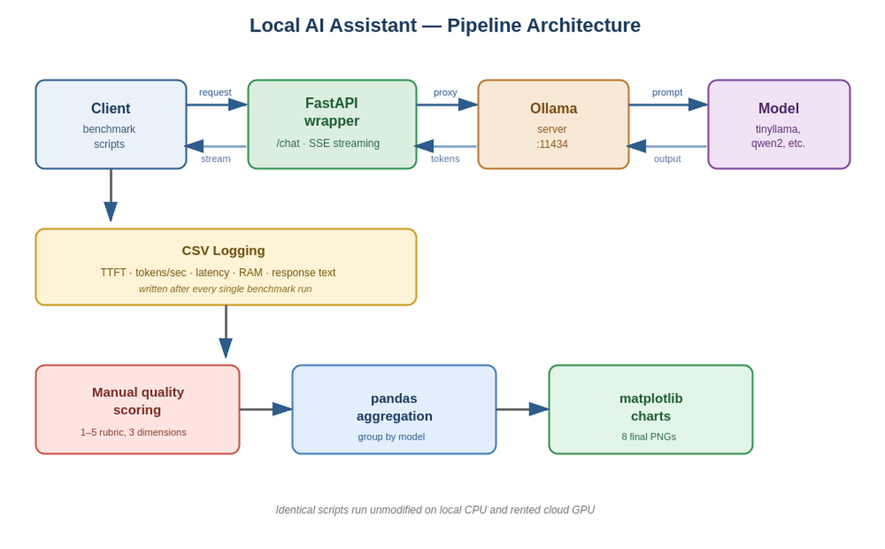
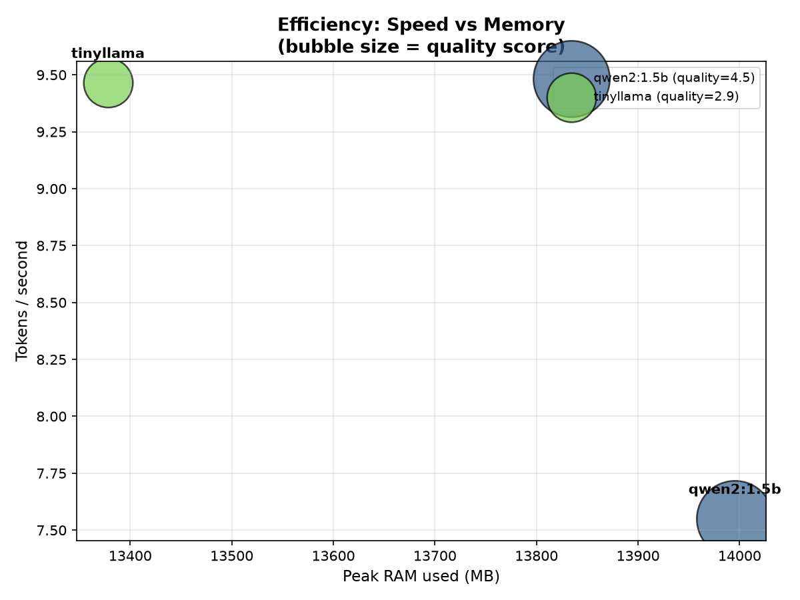
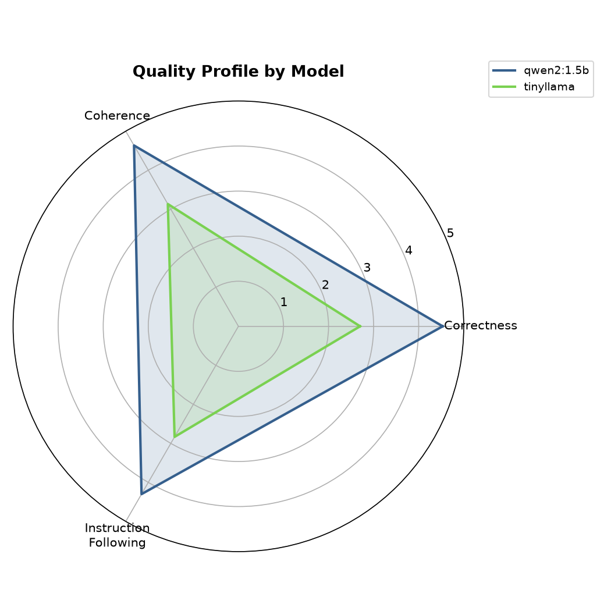
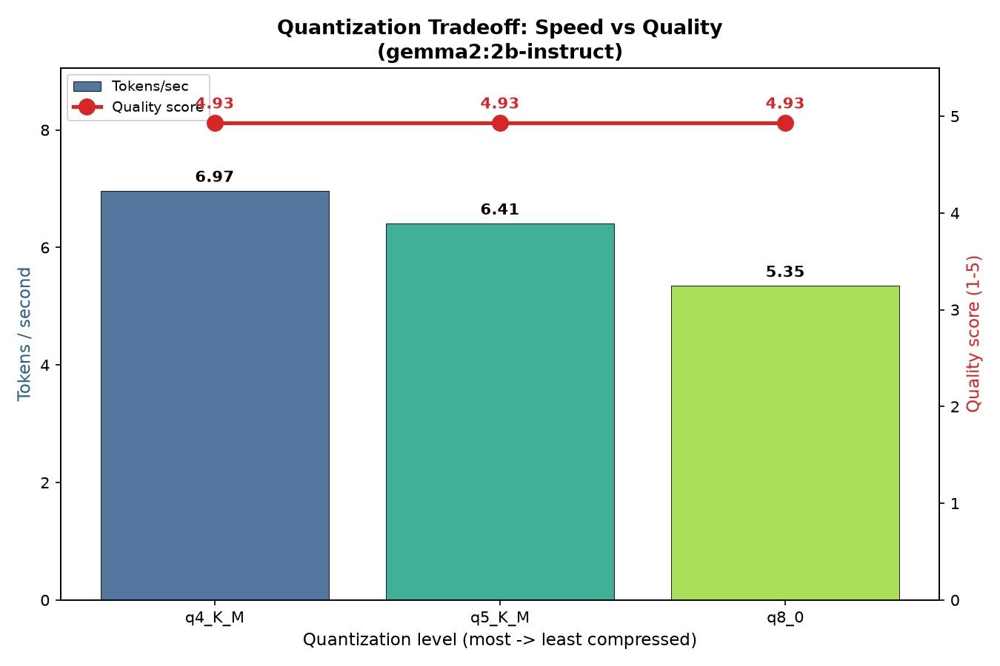
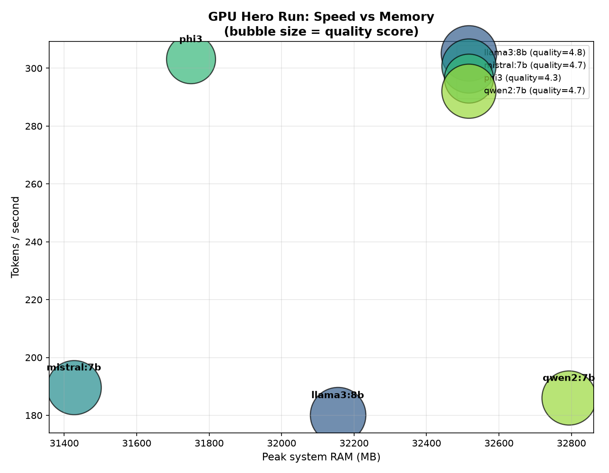

# Local AI Assistant

**An offline inference and benchmarking system for small language models — built and validated across CPU and GPU hardware tiers, with zero invented numbers.**

Every result below comes from a real, logged benchmark run. No estimates, no cherry-picking — the full raw CSVs and scoring data are in this repo.

---

## TL;DR

| | |
|---|---|
| **What** | A FastAPI + Ollama pipeline that benchmarks small LLMs for speed, structured-output reliability, and quality — then scales the same scripts unchanged from a free local CPU to a $1.19 cloud GPU session |
| **Why** | Privacy, zero API cost, low latency, offline availability |
| **Result** | 450+ benchmark runs, 8 charts, one clear recommendation matrix |
| **Cost** | $1.19 total cloud spend (76–88% under the $2–5 budget) |

---

## The recommendation matrix

The single table this whole project exists to produce — model × quantization level, scored on speed, memory, quality, and cost, with a one-line verdict.

| Model / Quant | Speed | Memory | Quality | Cost tier | Verdict |
|---|---|---|---|---|---|
| **qwen2:1.5b** | 10.9 tok/s | 14.0 GB peak | **4.49 / 5** | Free (CPU) | Best small-model choice when reliability matters |
| tinyllama | **14.3 tok/s** | 13.4 GB peak | 2.89 / 5 | Free (CPU) | Only for raw-speed, low-stakes free-text use |
| **gemma2:2b q4_K_M** | 6.97 tok/s | **1.7 GB disk** | **4.93 / 5** | Free (CPU) | Best for embedded / offline / storage-constrained |
| gemma2:2b q5_K_M | 6.41 tok/s | 1.9 GB disk | 4.93 / 5 | Free (CPU) | No advantage over Q4_K_M on this test set |
| gemma2:2b q8_0 | 5.35 tok/s | 2.8 GB disk | 4.93 / 5 | Free (CPU) | Use only if a harder task reveals Q4 degradation |
| mistral:7b | 189.7 tok/s | **31.4 GB peak** | 4.71 / 5 | $0.69/hr GPU | Best TTFT (0.05s) — best for interactive chat |
| **llama3:8b** | 180.1 tok/s | 32.2 GB peak | **4.82 / 5** | $0.69/hr GPU | Best overall quality if RAM/VRAM allows |
| qwen2:7b | 186.1 tok/s | 32.8 GB peak | 4.71 / 5 | $0.69/hr GPU | Balanced, no standout weakness |
| **phi3 (3.8B)** | **303.2 tok/s** | 31.7 GB peak | 4.26 / 5 | $0.69/hr GPU | Best raw GPU throughput; weakest instruction-following |

*Quality scored manually, 1–5, on correctness + coherence + instruction-following, averaged. Full scoring rubric and raw data in [`data/results/`](data/results/).*

---

## Headline findings

**Reliability beats raw speed at small scale.** qwen2:1.5b hit 100% structured-JSON compliance and a 4.49/5 quality score. tinyllama — despite generating tokens 31–56% faster — only managed 10–30% JSON compliance and a 2.89/5 quality score. Speed without reliability is a false economy.

**Quantization is nearly free at this scale.** Compressing gemma2:2b-instruct from Q8_0 down to Q4_K_M produced **zero measurable quality loss** (4.93/5 at all three levels) while improving speed by 30% and cutting disk size by 40%.

**GPU acceleration delivers 15–20× the throughput.** The same architecture class that ran at 7–14 tok/s on a local CPU reached 180–317 tok/s on a rented RTX 4090, for a total session cost of $1.19.

**The quality gap narrows as models scale up.** Small models (1–2B) spread 1.60 points apart on quality (2.89–4.49/5). Hero models (7–8B) spread only 0.56 points apart (4.26–4.82/5) — model choice matters far more at small scale than large scale.

**phi3 is the standout speed/quality tradeoff.** At just 3.8B parameters — half the size of the other hero models — it ran 60% faster than the next-fastest model, but scored lowest on quality, driven by weaker instruction-following (3.93/5 vs 4.5+ for the others).

---

## Architecture



The same scripts run unmodified on local CPU (development) and rented GPU (final hero-model data) — see [Approach](#approach) below.

---

## Approach

Built in six phases, each ending in a GitHub commit checkpoint:

| Phase | What | Where |
|---|---|---|
| **0 — Setup** | Ollama + FastAPI wrapper, streaming `/chat` endpoint | [`app/main.py`](app/main.py) |
| **1 — Baseline harness** | TTFT, tokens/sec, latency measurement, validated on tinyllama & qwen2:1.5b | [`scripts/phase1_baseline_harness.py`](scripts/phase1_baseline_harness.py) |
| **2 — Structured output** | Pydantic-validated JSON, retry logic, temp 0.0 vs 0.7 comparison | [`scripts/phase2_structured_output.py`](scripts/phase2_structured_output.py) · [report](reports/phase2_structured_output_report.md) |
| **3 — Model comparison** | 30-prompt suite, RAM tracking, manual 1–5 quality scoring, 3 charts | [`scripts/phase3_comparison.py`](scripts/phase3_comparison.py) |
| **4 — Quantization** | Same model (gemma2:2b-instruct) at Q4/Q5/Q8, speed vs quality tradeoff | [`scripts/phase4_quantization.py`](scripts/phase4_quantization.py) |
| **5 — GPU hero run** | Identical scripts, unchanged, on a rented RTX 4090 — 4 models, 360 runs, $1.19 | [`phase5_setup.sh`](phase5_setup.sh) |
| **6 — Report** | Full synthesis, CPU vs GPU comparison, recommendation matrix | [`reports/Local_AI_Assistant_Phase6_Report.docx`](reports/Local_AI_Assistant_Phase6_Report.docx) |

**Strategy:** debug the entire pipeline for free on small CPU models first. Only once every script was proven correct on 450+ local runs did a single, focused, low-cost GPU session run — meaning zero cloud minutes were spent on debugging.

---

## Charts

<table>
<tr>
<td width="50%"></td>
<td width="50%"></td>
</tr>
<tr>
<td width="50%"></td>
<td width="50%"></td>
</tr>
</table>

All 8 charts (CPU baseline, quality radar, quantization tradeoff, GPU hero run) are in [`data/charts/`](data/charts/).

---

## Environment

| | CPU (Phases 0–4) | GPU (Phase 5) |
|---|---|---|
| Hardware | Windows 11, 16-core / 32-thread, 125 GB RAM | RunPod RTX 4090, 24 GB VRAM, 8 vCPU |
| Cost | $0 | $1.19 total (~2 hr session) |
| Models | tinyllama, qwen2:1.5b, gemma2:2b-instruct (3 quant levels) | mistral:7b, llama3:8b, phi3, qwen2:7b |

---

## Stack

`Ollama` · `FastAPI` · `Pydantic v2` · `httpx` · `pandas` · `matplotlib` · `psutil` · Python 3.10+

---

## Repo structure

```
local-ai-assistant/
│
├── app/
│   ├── __init__.py
│   └── main.py                          FastAPI wrapper — Ollama proxy, streaming /chat endpoint
│
├── scripts/
│   ├── validate_setup.py                Pre-flight check: Ollama + FastAPI reachability
│   ├── phase1_baseline_harness.py       TTFT / tokens-sec / latency benchmark harness
│   ├── phase2_structured_output.py      Pydantic JSON validation + retry logic
│   ├── phase2_report_generator.py       Generates the Phase 2 markdown report
│   ├── phase3_comparison.py             30-prompt comparison + RAM tracking + scoring prep
│   ├── phase3_charts.py                 Bar / scatter / radar chart generation (CPU)
│   ├── phase4_quantization.py           Same-model quantization comparison (Q4/Q5/Q8)
│   ├── phase4_charts.py                 Quantization tradeoff chart generation
│   └── phase5_gpu_charts.py             GPU hero-run chart generation
│
├── tools/
│   ├── summarise_results.py             Quick pandas summary of any benchmark CSV
│   ├── verify_scores.py                 Validates Phase 3 manual scoring (encoding, ranges)
│   ├── verify_phase4_scores.py          Validates Phase 4 manual scoring
│   └── verify_gpu_scores.py             Validates Phase 5 GPU manual scoring
│
├── data/
│   ├── charts/                          All 8 final benchmark charts + architecture diagram
│   └── results/                         Raw + scored benchmark CSVs (gitignored except final scored sets)
│
├── reports/
│   ├── phase2_structured_output_report.md     Temp 0.0 vs 0.7 reliability tables
│   └── Local_AI_Assistant_Phase6_Report.docx  Full 19-page consolidated report
│
├── debug_archive/                       One-off debugging scripts, kept for transparency
│
├── phase5_setup.sh                      One-shot RunPod cloud GPU setup (Ollama + FastAPI + models)
├── requirements.txt                     Python dependencies
├── .gitignore
└── README.md                            This file
```

---

## Running it yourself

```bash
# 1. Install Ollama and pull a model
ollama pull qwen2:1.5b

# 2. Set up the environment
python -m venv venv && source venv/bin/activate
pip install -r requirements.txt

# 3. Start the API
uvicorn app.main:app --host 127.0.0.1 --port 8000 --reload

# 4. Validate the setup
python scripts/validate_setup.py

# 5. Run a benchmark
python scripts/phase1_baseline_harness.py --models qwen2:1.5b --quick
```

Full cloud GPU setup, including the one-shot RunPod install script, is in [`phase5_setup.sh`](phase5_setup.sh).

---

## Limitations

- RAM measurement captured total system memory, not per-process footprint — disk size is the more reliable proxy for quantization comparisons
- Quality scoring was manual and single-rater (1–5 rubric, see [`data/results/`](data/results/) for raw scores)
- The "zero quality loss from quantization" finding is based on a 10-prompt test set on one model family — worth validating against a larger, harder benchmark
- Full discussion in [`reports/Local_AI_Assistant_Phase6_Report.docx`](reports/Local_AI_Assistant_Phase6_Report.docx)

---

## Full report

The complete 19-page write-up — including methodology, all charts, the side-by-side CPU/GPU comparison, and the recommendation matrix above — is in [`reports/Local_AI_Assistant_Phase6_Report.docx`](reports/Local_AI_Assistant_Phase6_Report.docx).
